# Final Project - dash and visualizin


## Question 1
```python
df_line = df_sales.groupby('Year')['Automobile_Sales'].mean()
plt.figure(figsize=(10, 6))
df_line.plot(kind='line')
plt.xticks(list(range(1980, 2024)), rotation=75)
plt.xlabel('Año')
plt.ylabel('Ventas Promedio de Automóviles')
plt.title('Ventas de Automóviles durante Recesión')
plt.text(1982, df_line[1982], 'Recesión 1981-82')
plt.text(2008, df_line[2008], 'Recesión 2008')
plt.legend(['Ventas'])
plt.savefig('Line_Plot_1.png')
plt.show()
````
    
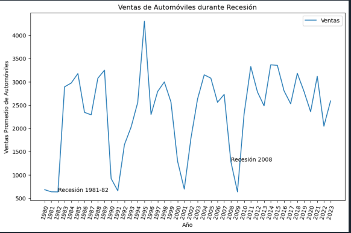


## Question 2
```python
df_rec = df_sales[df_sales['Recession'] == 1]
df_Mline = df_rec.groupby(['Year', 'Vehicle_Type'], as_index=False)['Automobile_Sales'].mean()
df_Mline.set_index('Year', inplace=True)
plt.figure(figsize=(12, 8))
for vehicle_type in df_Mline['Vehicle_Type'].unique():
    data = df_Mline[df_Mline['Vehicle_Type'] == vehicle_type]
    plt.plot(data.index, data['Automobile_Sales'], label=vehicle_type, marker='o')
plt.xlabel('Año')
plt.ylabel('Ventas de Automóviles')
plt.title('Ventas de Automóviles por Tipo de Vehículo Durante Recesión')
plt.legend(title="Tipo de Vehículo", bbox_to_anchor=(1.05, 1), loc='upper left')
plt.savefig('Line_Plot_2.png')
plt.show()
````
                 
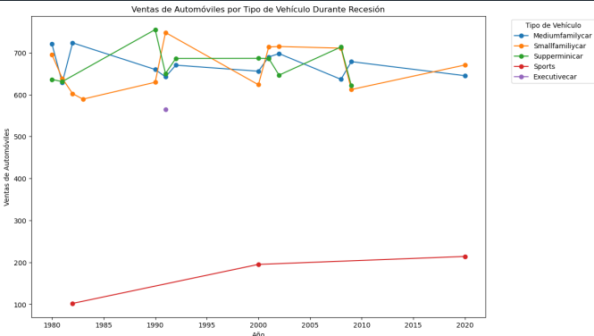


## Question 3 

```python
dd = df_sales.groupby(['Recession', 'Vehicle_Type'])['Automobile_Sales'].mean().reset_index()
plt.figure(figsize=(10, 6))
sns.barplot(x='Recession', y='Automobile_Sales', hue='Vehicle_Type', data=dd)
plt.xticks(ticks=[0, 1], labels=['No Recesión', 'Recesión'])
plt.xlabel('Periodo')
plt.ylabel('Ventas Promedio de Automóviles')
plt.title('Ventas por Tipo de Vehículo durante Periodos de Recesión y No Recesión')
plt.savefig('Bar_Chart.png')
plt.show()

````
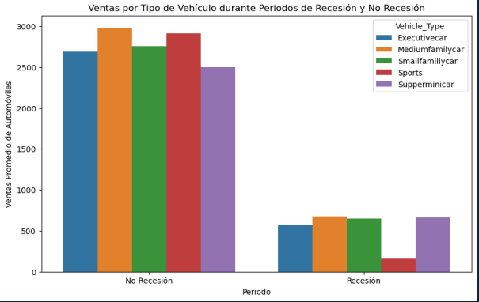


## Quesiton 4
```python
rec_data = df_sales[df_sales['Recession'] == 1]
non_rec_data = df_sales[df_sales['Recession'] == 0]
fig, (ax0, ax1) = plt.subplots(1, 2, figsize=(12, 6))
sns.lineplot(x='Year', y='GDP', data=rec_data, label='Recesión', ax=ax0)
ax0.set_xlabel('Año')
ax0.set_ylabel('PIB')
ax0.set_title('Variación del PIB durante Recesión')
sns.lineplot(x='Year', y='GDP', data=non_rec_data, label='No Recesión', ax=ax1)
ax1.set_xlabel('Año')
ax1.set_ylabel('PIB')
ax1.set_title('Variación del PIB durante No Recesión')
plt.tight_layout()
plt.savefig('Subplot.png')
plt.show()

````
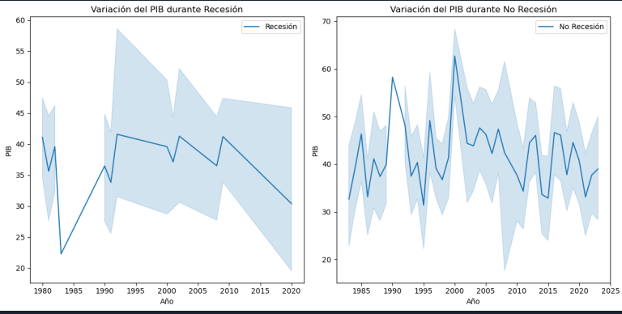

# Question 5
```python
non_rec_data = df_sales[df_sales['Recession'] == 0]
size = non_rec_data['Seasonality_Weight']
sns.scatterplot(data=non_rec_data, x='Month', y='Automobile_Sales', size=size, legend=False)
plt.xlabel('Mes')
plt.ylabel('Ventas de Automóviles')
plt.title('Impacto de la Estacionalidad en las Ventas de Automóviles')
plt.savefig('Bubble.png')
plt.show()
````
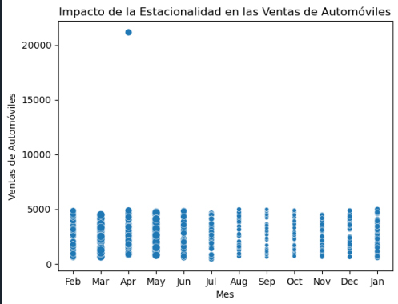


# Question 6
```python
rec_data = df_sales[df_sales['Recession'] == 1]
plt.scatter(rec_data['Price'], rec_data['Automobile_Sales'])
plt.xlabel('Precio Promedio del Vehículo')
plt.ylabel('Ventas de Automóviles')
plt.title('Relación entre Precio Promedio del Vehículo y Ventas durante Recesiones')
plt.savefig('Scatter.png')
plt.show()
````
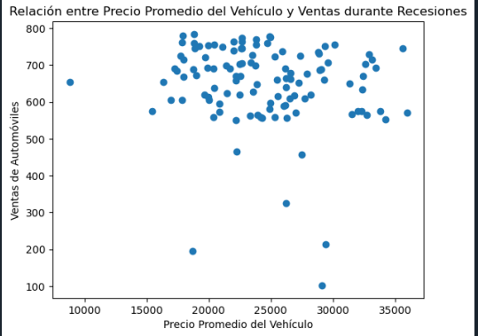


# Quesiton 7
```python
Rdata = df_sales[df_sales['Recession'] == 1]
NRdata = df_sales[df_sales['Recession'] == 0]
RAtotal = Rdata['Advertising_Expenditure'].sum()
NRAtotal = NRdata['Advertising_Expenditure'].sum()
plt.figure(figsize=(8, 6))
labels = ['Recesión', 'No Recesión']
sizes = [RAtotal, NRAtotal]
plt.pie(sizes, labels=labels, autopct='%1.1f%%', startangle=90)
plt.title('Gasto en Publicidad durante Periodos de Recesión y No Recesión')
plt.savefig('Pie_1.png')
plt.show()

````
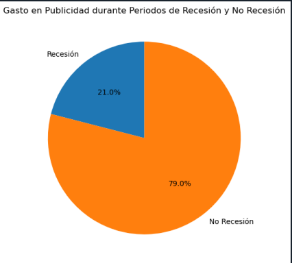
 # Quesiton 8
```python
VTexpenditure = Rdata.groupby('Vehicle_Type')['Advertising_Expenditure'].sum()
plt.figure(figsize=(8, 6))
labels = VTexpenditure.index
sizes = VTexpenditure.values
plt.pie(sizes, labels=labels, autopct='%1.1f%%', startangle=90)
plt.title('Participación de Cada Tipo de Vehículo en el Gasto Total de Publicidad durante Recesiones')
plt.savefig('Pie_2.png')
plt.show()
````
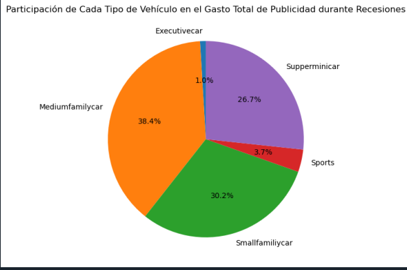

 # Quesiton 9
```python
sns.lineplot(data=rec_data, x='unemployment_rate', y='Automobile_Sales', hue='Vehicle_Type', style='Vehicle_Type', markers='o', err_style=None)
plt.ylim(0, 850)
plt.xlabel('Tasa de Desempleo')
plt.ylabel('Ventas de Automóviles')
plt.title('Efecto de la Tasa de Desempleo en el Tipo de Vehículo y las Ventas durante Recesión')
plt.legend(loc=(0.05, 0.3))
plt.savefig('line_plot_3.png')
plt.show()

````
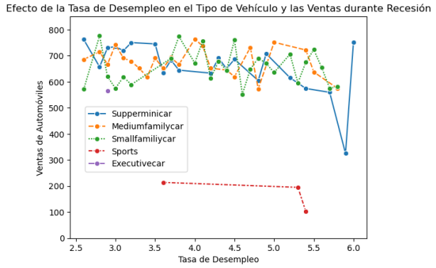

 # Quesiton 2.1
```python
app = dash.Dash(__name__)
app.title = "Panel de Ventas de Automóviles: Análisis de Recesión y Estadísticas Anuales"

# Lista de años para el desplegable
year_list = list(range(1980, 2024))

````
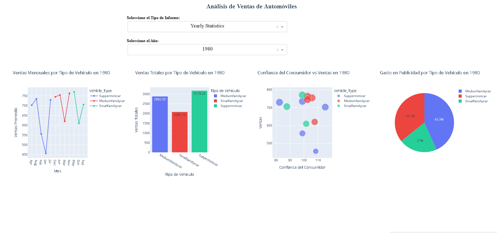

 # Quesiton 2.2
```python
report_dropdown = dcc.Dropdown(
    id='dropdown-statistics',
    options=[
        {'label': 'Yearly Statistics', 'value': 'Yearly Statistics'},
        {'label': 'Recession Period Statistics', 'value': 'Recession Period Statistics'}
    ],
    placeholder='Select a report type',
    value='Yearly Statistics',
    style={'width': '80%', 'padding': '3px', 'fontSize': '20px', 'textAlignLast': 'center'}
)

# Desplegable para selección de año
year_dropdown = dcc.Dropdown(
    id='select-year',
    options=[{'label': str(i), 'value': i} for i in year_list],
    placeholder='Select-year',
    value=year_list[0],
    style={'width': '80%', 'padding': '3px', 'fontSize': '20px', 'textAlignLast': 'center'}
)

````
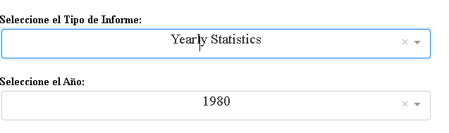
 # Quesiton 2.3
```python
output_container = html.Div(
    id='output-container',
    className='chart-grid',
    style={'display': 'flex', 'flexWrap': 'wrap', 'justifyContent': 'center'}
)

# Definir el layout de la aplicación
app.layout = html.Div([
    # Título principal
    html.H1("Análisis de Ventas de Automóviles",
            style={'textAlign': 'center', 'color': '#2c3e50', 'fontSize': '24px'}),
    
    # División para el desplegable de tipo de informe
    html.Div([
        html.Label("Seleccione el Tipo de Informe:", style={'fontWeight': 'bold'}),
        report_dropdown
    ], style={'margin': '20px', 'width': '50%', 'marginLeft': 'auto', 'marginRight': 'auto'}),
    
    # División para el desplegable de año
    html.Div([
        html.Label("Seleccione el Año:", style={'fontWeight': 'bold'}),
        year_dropdown
    ], style={'margin': '20px', 'width': '50%', 'marginLeft': 'auto', 'marginRight': 'auto'}),
    
    # División para los gráficos
    output_container
])


````
 # Quesiton 2.4
```python

@app.callback(
    Output(component_id='select-year', component_property='disabled'),
    Input(component_id='dropdown-statistics', component_property='value')
)
def update_input_container(selected_statistics):
    if selected_statistics == 'Yearly Statistics':
        return False
    else:
        return True

# Callback para actualizar los gráficos en el contenedor de salida
@app.callback(
    Output(component_id='output-container', component_property='children'),
    [
        Input(component_id='dropdown-statistics', component_property='value'),
        Input(component_id='select-year', component_property='value')
    ]
)

````
 # Quesiton 2.5
```python

recession_data = df_sales[df_sales['Recession'] == 1]
        
        # Gráfico 1: Ventas promedio por tipo de vehículo durante recesión
        plot1 = px.bar(
            recession_data.groupby('Vehicle_Type')['Automobile_Sales'].mean().reset_index(),
            x='Vehicle_Type',
            y='Automobile_Sales',
            title='Ventas Promedio por Tipo de Vehículo en Recesión',
            labels={'Vehicle_Type': 'Tipo de Vehículo', 'Automobile_Sales': 'Ventas Promedio'},
            color='Vehicle_Type',
            text='Automobile_Sales'
        )
        plot1.update_traces(texttemplate='%{text:.2f}', textposition='auto')
        
        # Gráfico 2: Impacto del precio en las ventas durante recesión
        plot2 = px.scatter(
            recession_data,
            x='Price',
            y='Automobile_Sales',
            color='Vehicle_Type',
            title='Relación entre Precio y Ventas durante Recesión',
            labels={'Price': 'Precio Promedio', 'Automobile_Sales': 'Ventas'},
            size='Automobile_Sales'
        )
        
        # Gráfico 3: Gasto en publicidad por tipo de vehículo
        plot3 = px.pie(
            recession_data.groupby('Vehicle_Type')['Advertising_Expenditure'].sum().reset_index(),
            values='Advertising_Expenditure',
            names='Vehicle_Type',
            title='Gasto en Publicidad por Tipo de Vehículo en Recesión'
        )
        
        # Gráfico 4: Ventas promedio por mes durante recesión
        plot4 = px.line(
            recession_data.groupby('Month')['Automobile_Sales'].mean().reset_index(),
            x='Month',
            y='Automobile_Sales',
            title='Ventas Promedio Mensuales en Recesión',
            labels={'Month': 'Mes', 'Automobile_Sales': 'Ventas Promedio'},
            markers=True
        )
        
        # Organizar los gráficos en 2 filas y 2 columnas
        return [
            html.Div(className='chart-item', children=[
                html.Div(dcc.Graph(figure=plot1), style={'width': '50%'}),
                html.Div(dcc.Graph(figure=plot2), style={'width': '50%'})
            ], style={'display': 'flex'}),
            html.Div(className='chart-item', children=[
                html.Div(dcc.Graph(figure=plot3), style={'width': '50%'}),
                html.Div(dcc.Graph(figure=plot4), style={'width': '50%'})
            ], style={'display': 'flex'})
        ]
    
    elif selected_statistics == 'Yearly Statistics' and selected_year is not None:

````
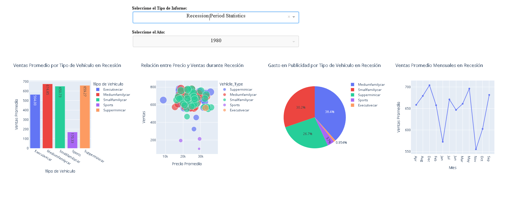
 # Quesiton 2.6
```python

 yearly_data = df_sales[df_sales['Year'] == selected_year]
        
        # Gráfico 1: Ventas mensuales promedio por tipo de vehículo
        plot1 = px.line(
            yearly_data.groupby(['Month', 'Vehicle_Type'])['Automobile_Sales'].mean().reset_index(),
            x='Month',
            y='Automobile_Sales',
            color='Vehicle_Type',
            title=f'Ventas Mensuales por Tipo de Vehículo en {selected_year}',
            labels={'Month': 'Mes', 'Automobile_Sales': 'Ventas Promedio'},
            markers=True
        )
        
        # Gráfico 2: Ventas totales por tipo de vehículo
        plot2 = px.bar(
            yearly_data.groupby('Vehicle_Type')['Automobile_Sales'].sum().reset_index(),
            x='Vehicle_Type',
            y='Automobile_Sales',
            title=f'Ventas Totales por Tipo de Vehículo en {selected_year}',
            labels={'Vehicle_Type': 'Tipo de Vehículo', 'Automobile_Sales': 'Ventas Totales'},
            color='Vehicle_Type',
            text='Automobile_Sales'
        )
        plot2.update_traces(texttemplate='%{text:.2f}', textposition='auto')
        
        # Gráfico 3: Impacto de la confianza del consumidor
        plot3 = px.scatter(
            yearly_data,
            x='Consumer_Confidence',
            y='Automobile_Sales',
            color='Vehicle_Type',
            title=f'Confianza del Consumidor vs Ventas en {selected_year}',
            labels={'Consumer_Confidence': 'Confianza del Consumidor', 'Automobile_Sales': 'Ventas'},
            size='Automobile_Sales'
        )
        
        # Gráfico 4: Gasto en publicidad por tipo de vehículo
        plot4 = px.pie(
            yearly_data.groupby('Vehicle_Type')['Advertising_Expenditure'].sum().reset_index(),
            values='Advertising_Expenditure',
            names='Vehicle_Type',
            title=f'Gasto en Publicidad por Tipo de Vehículo en {selected_year}'
        )
        
        # Organizar los gráficos en 2 filas y 2 columnas
        return [
            html.Div(className='chart-item', children=[
                html.Div(dcc.Graph(figure=plot1), style={'width': '50%'}),
                html.Div(dcc.Graph(figure=plot2), style={'width': '50%'})
            ], style={'display': 'flex'}),
            html.Div(className='chart-item', children=[
                html.Div(dcc.Graph(figure=plot3), style={'width': '50%'}),
                html.Div(dcc.Graph(figure=plot4), style={'width': '50%'})
            ], style={'display': 'flex'})
        ]
    

````
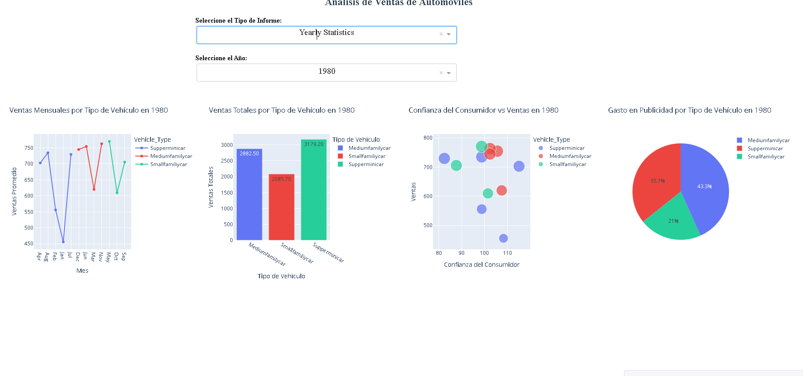
